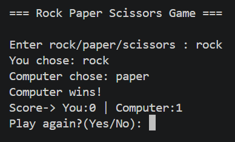
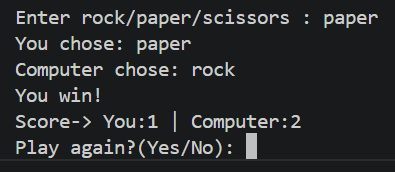
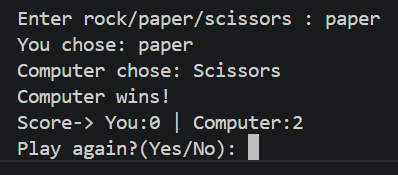
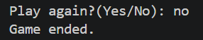

# 🎮 Rock Paper Scissors Game

## 📌 Overview
A Python-based Rock-Paper-Scissors game where the user plays against the computer. The game includes score tracking and multiple rounds.

---

## 🚀 Features
- User vs Computer gameplay
- Random computer choice
- Winner determination logic
- Score tracking
- Multiple rounds
- Input validation

---

## 🛠️ Tech Stack
- Python
- random module

---

## ▶️ How to Run

```
python rock_paper_scissors.py
```

---

## 📷 Screenshots









---

## 🧠 Learning Outcome
- Implemented game logic
- Used loops and conditions
- Improved user interaction handling